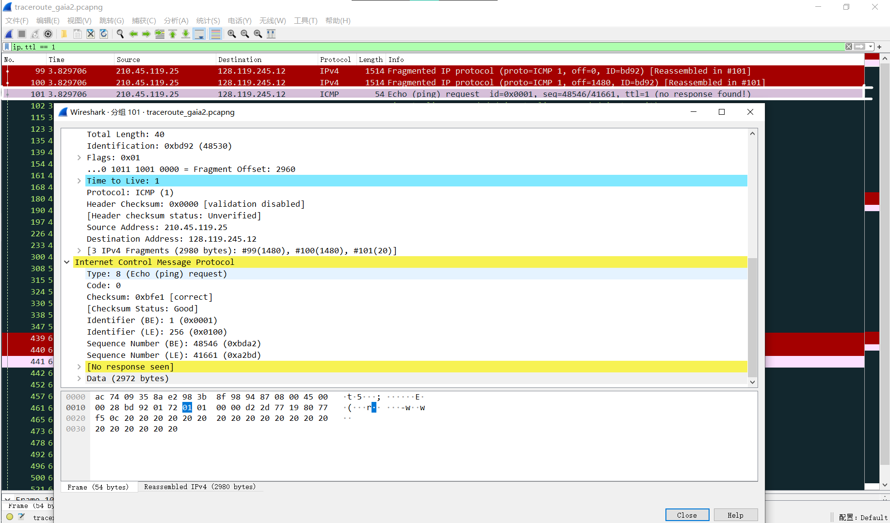

# PW2 实验文档

**实验名称：traceroute**

## A1
1. 过滤得到所有`ICMP`包的结果：

2. 过滤得到其他应用层协议包的结果：

这里过滤了`DNS`和`HTTP`的包。

`HTTP`的包应该不是`traceroute`产生的，因为我另一次`traceroute`时抓到的`HTTP`与Windows自动更新有关；我一个同学抓的包里就没有`HTTP`包。

虽然上面这个截图里的`HTTP`包的链接打不开，但我合理推测，觉得和`traceroute`无关。

## A2

1. 从本机到`gaia.cs.umas.edu`主机，一共有36跳：

2. 下图为`ICMP`第一个ttl = 1的`Echo Request` 的包：

3. 分片：

一共分了3片。（`Fragment count: 3`）

分片是因为，我们在设置里把包的大小设为3000 Bytes，并且允许包的分片；MTU最大是1500 Bytes，除去各协议的头部，小于包的长度，所以会分片。

## A3

1. `fregamentation and reassembly`：IP报文被分片后，只在dst_host处重组；报文的每个分片的小报文里，携带报文长度、ID（同个大报文的片段拥有同个ID）、flag（标识是否是最后一个报文片段，若flag=0x1，则不是，若flag=0x0，则是）和offset（表示该报文片段位于大报文的哪个位置）
2. 如下图的两个fregment就分别是中间和最后一个报文片段：

上图是报文片段的中间部分。

上图是报文片段的结尾（最后一个片段）。

3. `Total Length`表示这个报文片段的长度：

上图表示该报文片段的长度为40 bytes。

## A4

如图，ttl-exceeded包会返回给路由器，payload里有Type: 11的字段（Time-to-live exceeded）。

## A5

上图为traceroute的各跳路由器，由图知，从第7到第10跳是跨过了太平洋电缆，因为RTT明显增多（增加了7倍），说明路程更远。

router addresses: 202.97.100.5~202.97.51.206

## A6

第7跳的平均RTT：

$RTT~average_7 = (21+40+23)/3 = 28ms$​

第10跳的平均RTT：

$RTT~average_{10} = (162+172+157)/3 = 164ms$​​​

太平洋海底电缆的距离：

$S~pacific = [(164-28)/2]*10^{-3}*2*10^8 = 1.36*10^7m$​

